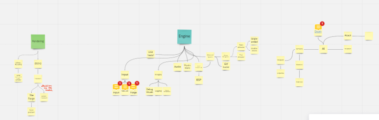
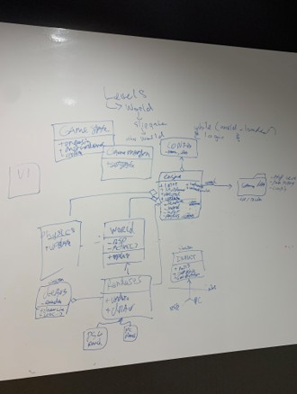
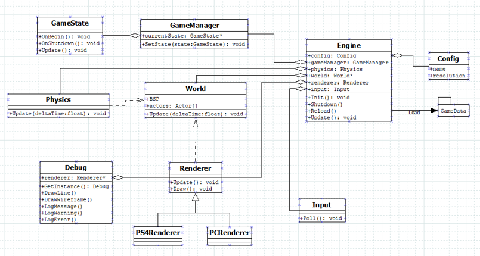
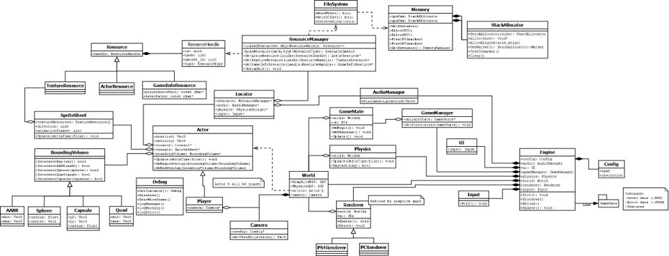
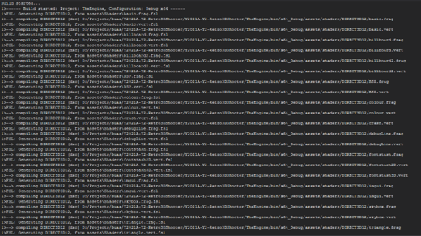
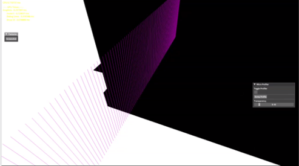
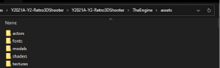
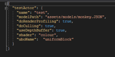
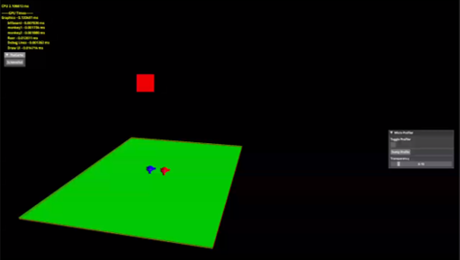

## Overview

This project, part of the International Game Architecture and Design (IGAD) program at Breda University of Applied Sciences, was a deep dive into the role of a graphics programmer. Our team was tasked with building a retro 3D shooter engine from the ground up. The primary challenge was creating a custom engine that could run on both PC and PlayStation 4, with a strong focus on mastering graphics systems and the nuances of cross-platform development.

**Key Focus Areas:**
* **Graphics Programming:** Gaining hands-on experience with graphics APIs and implementing complex rendering systems.
* **Engine Architecture:** Designing and constructing a robust, multi-platform game engine.
* **Team Collaboration:** Honing technical communication and teamwork skills within a programmer-only team.
* **Cross-Platform Development:** Navigating the challenges of developing for both Windows and the PlayStation 4 console.

## Current State of Competency

At the beginning of this block, I felt I had come a long way since starting at BUas with no C++ experience. I considered my ability to communicate effectively with both programmers and multi-disciplinary teams to be a strong suit. However, I knew my organizational skills needed improvement to be more reliable in a professional setting. My main ambition for this block was to immerse myself in graphics programming, drawn in by its blend of mathematical concepts and immediate visual feedback.

## Learning Goals

To guide my progress, I established the following SMART goals:

* **Academic and Professional Practice Goal:** I aimed to foster a healthier work-life balance by committing to standard work hours, avoiding the pattern of overwork from the previous block. My plan was to track my overtime weekly and actively work to minimize it.
* **Professional Skills and Knowledge Goal:** I wanted to thoroughly explore the responsibilities of a graphics programmer. My objective was to build a foundational knowledge of rendering systems by creating a small, standalone demo project from scratch using either DirectX 12 or OpenGL in my personal study time.

## Weekly Progress Highlights

### Week 1: Team Formation and Initial Brainstorming
I was thrilled to join the Retro 3D shooter team. We dedicated a significant amount of time to brainstorming and planning our engine's architecture. Although intense, this foundational work was crucial. As a personal warm-up, I was inspired to create a simple raycast renderer.

*Initial brainstorming session for the engine architecture.*

*Early draft of the engine's architecture on a whiteboard.*

### Week 2: Refining Engine Architecture and TDD
Our team made excellent progress in detailing the engine's systems. I took a deep dive into the PS4's architecture, which allowed us to make our Technical Design Document (TDD) much more relevant to our target platform. We concluded the week by presenting our initial engine design.

*An early UML diagram showing the core components of the engine.*

*The more detailed and final UML class diagram for our engine architecture.*

### Week 3: Project Setup and The Forge Integration
We successfully integrated "The Forge," a rendering framework, into our project. This week highlighted the importance of a streamlined project setup, as we faced delays waiting for access to the PS4 version of the framework and our Perforce repository. I also established the shader translation pipeline for our project.

*Screenshot of the successful shader translation process.*

### Week 4: Getting the Project Running on PS4
This week marked a major milestone: we got our project running on a PlayStation 4 for the first time. My contributions included creating an actor class and a model resource container. Feedback from our sprint review reminded us to provide more tangible proof of our progress and to remain mindful of our project's scope.

*Video showing the project running on a PS4 for the first time.*

### Week 5: Asset Pipeline and JSON System
I implemented a system to load model resources from JSON files, which required a significant but necessary overhaul of our asset folder structure. This experience served as a powerful reminder that asset pipelines should be thoughtfully designed early in the development process.

*The restructured ../assets folder, including JSON files for actors and models.*

*Example of the JSON structure for defining actors and models.*

### Week 6: Bug Fixing and Camera Rework
This week was a whirlwind of fixing small yet time-consuming issues, from shader bugs on the PS4 to incorrect input bindings. I also reworked the camera system, transferring control to the player and implementing cursor locking for a better user experience on Windows.

<video controls>
  <source src="../assets/videos/Y2A_W6_Cursor_Lock.gif" type="video/gif">
  Your browser does not support the video tag.
</video>
*Demonstration of the cursor locking feature and updated camera movement.*

### Week 7: Fixing the PS4 Build and Cross-Platform Challenges
I dedicated this week to resolving issues that had broken the PlayStation 4 build, which were mainly tied to texture loading. Despite feeling unwell, it was a valuable opportunity to learn about the complexities of cross-platform development and hardware-specific quirks.

*The project is up and running on the PS4 again after resolving texture issues.*

### Week 8: Final Presentation and Reflection
The final week was a push to complete our Intended Learning Outcomes (ILOs) and polish our final presentation. The feedback we received confirmed that we had been too ambitious with our initial scope, a critical lesson for future projects.

## Block Reflection

This block was an incredible learning experience. I'm immensely proud of our team for creating a 3D game engine from scratch in just eight weeks, and I'm particularly proud of my role in leading the PlayStation 4 implementation. A major hurdle was working with "The Forge" framework, which had limited documentation, forcing us to learn directly from source code and examples.

The most significant takeaway for me was the danger of over-scoping. Moving forward, I will advocate for a more iterative approach: build a small, polished core experience first, and then expand upon it. I also learned that meticulous planning during the initial stages is non-negotiable to prevent chaotic, on-the-fly decisions later. While I embraced my role as a Graphics Programmer, I found myself deeply engaged in gameplay and engine programming as well, and I am eager to continue exploring where my passions lie.

## Technical Skills Developed

-   **Programming Languages**: C++
-   **Graphics APIs**: DirectX 12, PlayStation's proprietary shading language
-   **Tools & Frameworks**: The Forge, Perforce, Visual Studio
-   **Methodologies**: Agile Development, SMART Goal Setting, Technical Design Documentation
-   **Collaboration**: Technical Teamwork, Remote Communication via Discord

## Key Takeaways

This project provided invaluable, hands-on experience in graphics programming, engine architecture, and team collaboration. It was a demanding but rewarding journey that significantly accelerated my growth as a game developer. The practical challenges of cross-platform development, especially for the PS4, have better prepared me for the technical complexities of the games industry.

---

*This project page is part of my ongoing portfolio documentation. For more details about specific implementations or to discuss this work, feel free to [contact me](mailto:ralphwarrand@gmail.com).*